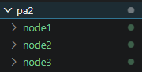
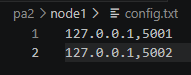
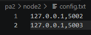
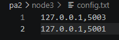
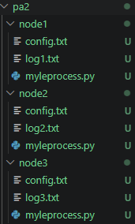
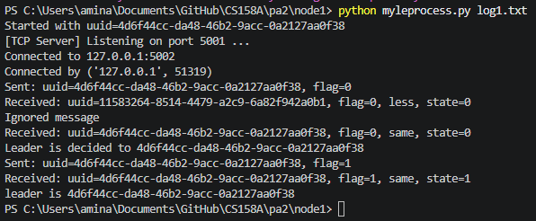
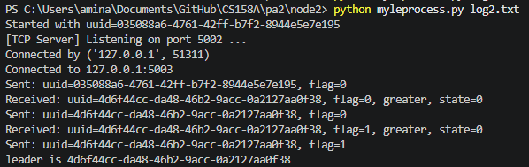
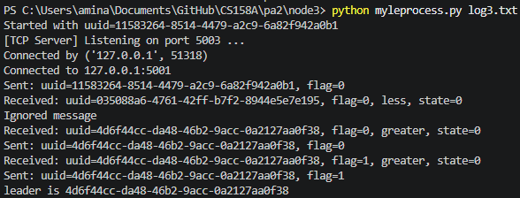

# PA #2: Leader Election Problem

## Create Node Folders
To run the program locally, create a folder for each node in the election ring. 

## Add Config and Code

Copy the myleprocess.py and paste it into each folder, and create a config.txt for each node and specify the node's own IP and port number, as well as it's neighbor's IP and port to create the ring. See the examples below.

  

## Log Files

Each node folder should also contain it's own log file, which will be filled once the python files are run.

## Example Run

Finally, to test the program locally, just open 3 terminals and run each node's python file. See the results below.

Node 1:

Node 2:

Node 3:

